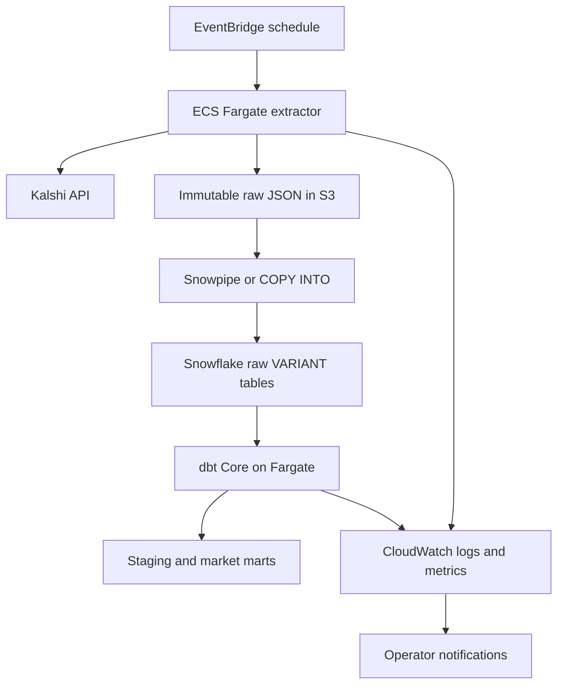

# Architecture

## Target architecture through Milestone 8



The diagram is a target, not permission to implement all components at once.
Milestone 1 ends at the local extraction boundary. Each later milestone adds one
operational boundary and proves it before proceeding.

## Milestone boundaries

| Milestone | Newly proven boundary |
| --- | --- |
| 1 | Fixture/live source → validated Python records |
| 2 | Validated extraction → immutable S3 payload and manifest |
| 3 | External failure → classified, observable run outcome |
| 4 | Scheduled AWS execution → expected S3 objects |
| 5 | S3 object → idempotent Snowflake raw record |
| 6 | Raw response → tested analytical relation |
| 7 | Failure or staleness → operator notification |
| 8 | Production incident/gap → detected and repaired data |

## Data layers

### Raw S3

- Exact source responses, compressed but not semantically transformed
- Append-only and partitioned by provider, entity, observation time, and run ID
- Accompanied by a run manifest and checksums
- Retained as the replay and audit source of truth

The accepted v1 object pattern is defined in the
[raw output contract](contracts/raw-output-v1.md):

```text
s3://<raw-bucket>/
  provider=kalshi/
    entity=markets/
      observed_date=YYYY-MM-DD/
        observed_hour=HH/
          run_id=<uuid>/
            response-0001.json.gz
            manifest.json
```

### Snowflake raw

- One immutable ingestion representation with a `VARIANT` payload
- File metadata, extraction run ID, observed timestamp, loaded timestamp, and
  schema/collector version retained beside the payload
- Idempotent at the source-object level

### dbt staging and marts

- Staging models normalize names and types
- Market snapshot facts remain append-only at an explicit grain
- Latest-state views are derived from snapshots rather than overwriting history
- Raw payload remains available for schema evolution and reprocessing

## Environment isolation

- Development and production use distinct identities, secrets, buckets, schedules,
  Snowflake roles, databases/schemas, warehouses, and Terraform state.
- Development schedules are disabled or infrequent by default.
- GitHub Actions deploys through AWS OIDC; no long-lived AWS keys are stored in GitHub.
- Local fixture tests require no network or cloud credentials.

## Observability contract

Every extraction run should eventually expose:

- `run_id`
- provider and entity
- start and completion timestamps in UTC
- status and error category
- page and record counts
- bytes and object counts
- source watermark when available
- collector version/Git SHA
- S3 object keys and checksums

The key operational signal is a successful-run heartbeat. A schedule invocation
alone does not prove that data reached S3 or Snowflake.
